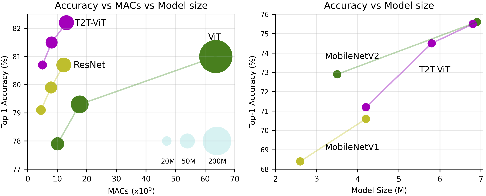

# Tokens-to-Token ViT: Training Vision Transformers from Scratch on ImageNet, [arxiv](https://arxiv.org/abs/2101.11986)

### Update: 2020/02/02: About the GPU memory problem. 

We will release the implementation of Performer layer in T2T module next week. Currently, all models taking Transformer layer cause very high GPU memory as it needs huge memory to save the attention map in T2T module. After we release the Performer implementations, you can run our T2T-ViT in your 12G GPUs. 




Our codes are based on the [official imagenet example](https://github.com/pytorch/examples/tree/master/imagenet) by [PyTorch](https://pytorch.org/) and [pytorch-image-models](https://github.com/rwightman/pytorch-image-models) by [Ross Wightman](https://github.com/rwightman)


## Requirements
[timm](https://github.com/rwightman/pytorch-image-models), pip install timm

torch>=1.4.0

torchvision>=0.5.0

pyyaml


## T2T-ViT Models


| Model    | T2T Transformer | Top1 Acc | #params |  Download|
| :---     |   :---:         |  :---:   |  :---:  |  :---:  | 
| T2T-ViT_t-14 | Transformer |   80.7   |  21.5M | [here](https://drive.google.com/file/d/1GG_hOMwC_ceDt_FqlESQ8QhCHATLfIJC/view?usp=sharing)  | 
| T2T-ViT_t-19 | Transformer |   81.75   |  39.0M | [here](https://drive.google.com/file/d/1GdTwGuvZKiZTs4euAmEvRwT_czDOKKqJ/view?usp=sharing) | 
| T2T-ViT_t-24 | Transformer |   82.2   |  64.1M | [here](https://drive.google.com/file/d/1Edw9jFasXFl5LVrRvJ44vMuQXOlvbDJP/view?usp=sharing) | 
| T2T-ViT-7    |  Performer  |   71.2   |  4.2M  | [here](https://drive.google.com/file/d/1nmp77cSrGfE1CeW_aUAFihfxmz4AWAcT/view?usp=sharing)| 
| T2T-ViT-10   |  Performer  |   74.1   |  5.8M  | [here](https://drive.google.com/file/d/1mn4Qyl-WfmytDSB530Nb0ie3Y5DMCzM_/view?usp=sharing)  | 
| T2T-ViT-12   |  Performer  |   75.5   |  6.8M  | [here](https://drive.google.com/file/d/1LMnlAFJsKnQLfbqX0vYs4n30H4DfXuI8/view?usp=sharing)  | 


## Test

Test the T2T-ViT_t-14 (take transformer in T2T transformer),

Download the [T2T-ViT_t-14](https://drive.google.com/file/d/1GG_hOMwC_ceDt_FqlESQ8QhCHATLfIJC/view?usp=sharing), then test it by running:

```
CUDA_VISIBLE_DEVICES=0 python main.py path/to/data --model T2t_vit_t_14 -b 100 --eval_checkpoint path/to/checkpoint
```

Test the T2T-ViT_t-24 (take transformer in T2T transformer),

Download the [T2T-ViT_t-24](https://drive.google.com/file/d/1Edw9jFasXFl5LVrRvJ44vMuQXOlvbDJP/view?usp=sharing), then test it by running:

```
CUDA_VISIBLE_DEVICES=0 python main.py path/to/data --model T2t_vit_t_24 -b 100 --eval_checkpoint path/to/checkpoint
```

## Train

Train the T2T-ViT_t-14 (take transformer in T2T transformer):
```
CUDA_VISIBLE_DEVICES=0,1,2,3,4,5,6,7 ./distributed_train.sh 8 path/to/data --model T2t_vit_t_14 -b 64 --lr 5e-4 --weight-decay .05 --img-size 224
```

Train the T2T-ViT_t-24 (take transformer in T2T transformer):
```
CUDA_VISIBLE_DEVICES=0,1,2,3,4,5,6,7 ./distributed_train.sh 8 path/to/data --model T2t_vit_t_24 -b 64 --lr 5e-4 --weight-decay .05 --img-size 224
```


Updating...


## Reference
If you find this repo useful, please consider citing:
```
@misc{yuan2021tokenstotoken,
    title={Tokens-to-Token ViT: Training Vision Transformers from Scratch on ImageNet},
    author={Li Yuan and Yunpeng Chen and Tao Wang and Weihao Yu and Yujun Shi and Francis EH Tay and Jiashi Feng and Shuicheng Yan},
    year={2021},
    eprint={2101.11986},
    archivePrefix={arXiv},
    primaryClass={cs.CV}
}
```
